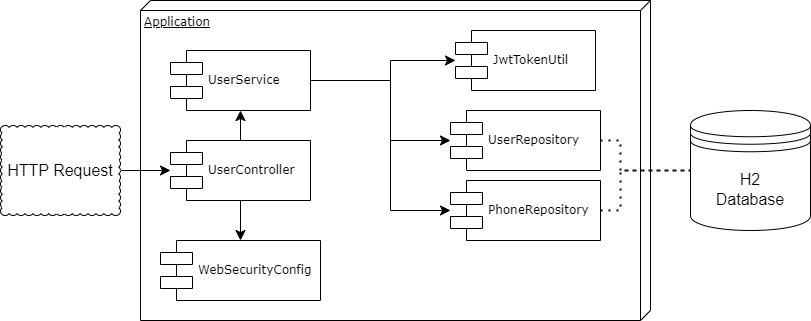
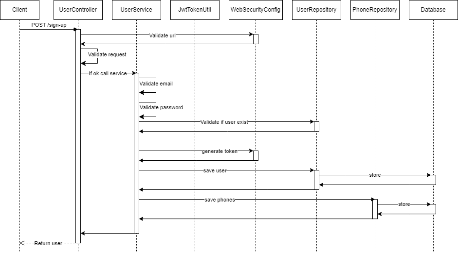
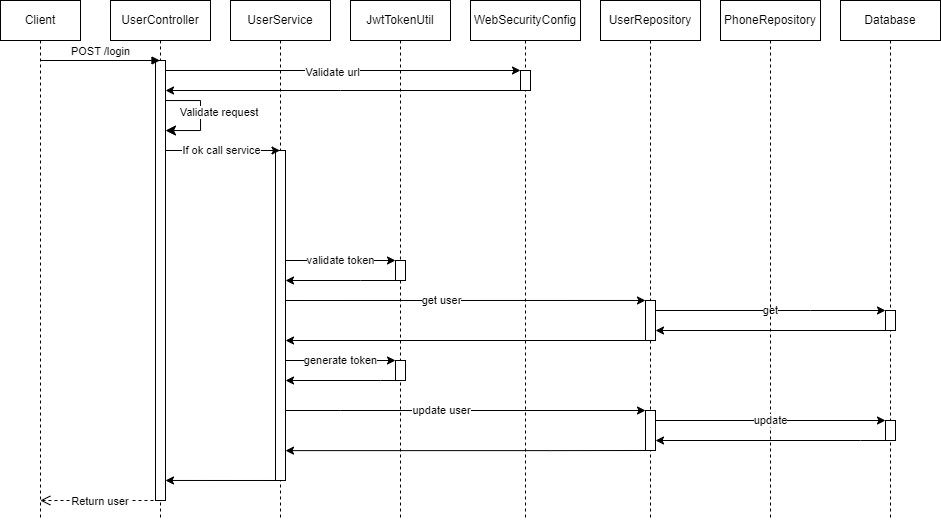

# User Demo Service

Este servicio permite registrar usuarios en una base de datos.

El proceso de registro de usuarios se hace en una base de datos h2 en memoria para este ejemplo.
Durante el proceso de insercion de usuario se genera un token jwt el cual servira para realizar el login

En el proceso de login, la validacion de usuariose hace verificando que el token no haya expirado y sea integro

Para compilar el proyecto se debe ejecutar los siguientes comandos desde la raiz

### Windows

.\gradlew clean build

java -jar build/libs/user-demo-service-1.0.1.jar

### Unix

./gradle clean build

java -jar build/libs/user-demo-service-1.0.1.jar

En en archivo para postman [Demo User.postman_collection.json](Demo%20User.postman_collection.json)
se encuentran ejemplos de request para ambos endpoint.

En las siguientes imagenes se detalla la interaccion de componentes

## Diagrama de componentes

## Diagrama de secuencia servicio sign-up

## Diagrama de secuencia servicio login
